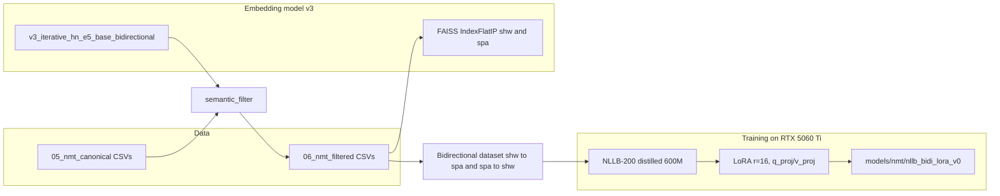

SA-BiNLLB Implementation Plan (Windows + CUDA, RTX 5060 Ti)

This plan is a working continuation of the original SA-BiNLLB plan. It absorbs the deviations already taken during scaffolding (Phase 0), reflects the current Windows/CUDA execution target (RTX 5060 Ti, sm_120 / Blackwell), and lists the concrete commands and modules still pending.

Adaptation rules (unchanged)

- New NMT code: `src/nmt/` (legacy moved to `src/nmt/_legacy/`).
- NMT data outputs: `data/processed/05_nmt_canonical/`, `06_nmt_filtered/`, `07_nmt_augmented/`.
- Configs: `config/nmt/*.yaml`.
- Checkpoints: `models/nmt/<run_name>/` (e.g. `models/nmt/nllb_bidi_lora_v0/`).
- Reports: `reports/05_nmt/{preprocessing,training,evaluation,reranking,augmentation}/`.
- Phase-runner scripts: `scripts/nmt/NN_<step>.py`, invoked via `python -m scripts.nmt.NN_<step>` from the workspace root.
- Source of truth for raw pairs: existing `data/processed/04_splits/{train,valid,test}.jsonl` (closed by embeddings work). The NMT pipeline never re-derives splits — it inherits the same `pair_id`/`group_id` to avoid leakage between embeddings retrieval and NMT training.

Hardware target

- GPU: NVIDIA GeForce RTX 5060 Ti, 16 GB VRAM, sm_120 (Blackwell).
- Driver / CUDA: NVIDIA 596.36, CUDA 13.2-capable host. Wheels: cu128.
- OS: Windows 10/11 (PowerShell). Paths use backslashes; commands are PowerShell-style.
- Torch wheels: `torch==2.7.1+cu128`, must be installed from the PyTorch index, not PyPI default. Default PyPI gives the CPU build.

---

Phase 0 — Environment + scaffolding (DONE except .venv-nmt)

Status snapshot (2026-05-09):

- [x] `requirements/nmt.txt` exists with the cu128 install instructions, `torch==2.7.1`, `transformers==4.55.0`, `accelerate==1.8.1`, `peft==0.16.0`, `sentence-transformers>=5.4.1,<6`, `unbabel-comet==2.2.4`, `numpy<2`, `setuptools<81`. (`sentence-transformers` was bumped from `4.1.0` after verifying that the frozen v3 checkpoint requires 5.4+ module paths.)
- [x] `config/nmt/{filter,training,inference,reranker,eval}.yaml` populated with the values from plan §13/§23-32/§34.
- [x] Legacy NMT code moved to `src/nmt/_legacy/`.
- [x] New empty packages: `src/nmt/{preprocessing,training,reranking,evaluation,inference,augmentation}/__init__.py`.
- [x] `scripts/nmt/__init__.py` placeholder.
- [x] Frozen embedding model `models/sentence_transformers/v3_iterative_hn_e5_base_bidirectional/` is in place (not nested), `model.safetensors` 1.06 GB, loads cleanly with sentence-transformers 5.4.1 (verified: dim 768, L2 norm 1.0, `cos("escucha atentamente.", "lau'ker' musu'") = 0.667`, `cos("escucha atentamente.", "adios") ≈ 0.0`).
- [ ] Dedicated `.venv-nmt/` with Python 3.12 and the cu128 stack — pending.

Pending work

1. Create the isolated NMT venv with the system Python 3.12:

   ```powershell
   py -3.12 -m venv .venv-nmt
   .\.venv-nmt\Scripts\Activate.ps1
   python -m pip install --upgrade pip wheel
   pip install torch==2.7.1 --index-url https://download.pytorch.org/whl/cu128
   pip install -r requirements/nmt.txt
   ```

2. Smoke-test CUDA + the full stack:

   ```powershell
   python -c "import torch, transformers, peft, sentence_transformers, faiss, comet, sacrebleu, bert_score; print('torch', torch.__version__, 'cuda', torch.cuda.is_available(), torch.version.cuda); print('sm', torch.cuda.get_device_capability(0) if torch.cuda.is_available() else None); print('ok')"
   ```

   Expected: `cuda True`, `cuda 12.8`, `sm (12, 0)`, `ok`. If `torch.cuda.is_available()` is False, the cu128 wheel did not install (PyPI default re-resolved to CPU). Re-run step 1.

3. Document activation block in `README.md` ("Pipeline NMT (NLLB + LoRA)" section), pointing at `.venv-nmt`, and the cu128 install gotcha.

---

Phase 1 — Dataset freeze (canonical CSV)

Same as before, no Windows-specific changes.

- New script: `scripts/nmt/10_canonicalize_dataset.py` → `python -m scripts.nmt.10_canonicalize_dataset`.
- For each split (`train`, `valid`, `test`) and each row in [`data/processed/04_splits/train.jsonl`](data/processed/04_splits/train.jsonl), [`valid.jsonl`](data/processed/04_splits/valid.jsonl), [`test.jsonl`](data/processed/04_splits/test.jsonl), emit two rows: one shw → spa and one spa → shw. Inherit `pair_id` and `group_id` from the embeddings split.
- Write to `data/processed/05_nmt_canonical/{train,valid,test}.csv` with columns: `id,pair_id,group_id,source,target,source_lang,target_lang,split,has_audit_flags,origin_source` where `id = f"{pair_id}__{src_lang}2{tgt_lang}"`.
- Use `shw` and `spa` as language codes (mapped to `shw_Latn` / `spa_Latn` at training time).
- Manifest: `reports/05_nmt/preprocessing/canonical_manifest.json` — counts per direction and split, sha256 of inputs.
- Sanity: row counts should be 2 × (2563 + 320 + 321) = 6408. Same `group_id` never appears in two splits.

Implementation notes:
- Use `pandas.read_json(..., lines=True)` and `pandas.DataFrame.to_csv(..., encoding='utf-8-sig')` so Excel on Windows opens UTF-8 correctly (the BOM doesn't affect downstream pandas reads).

---

Phase 2 — Semantic filtering + FAISS

- Module `src/nmt/preprocessing/semantic_filter.py`. Loads `models/sentence_transformers/v3_iterative_hn_e5_base_bidirectional` (already verified loadable), encodes source and target per row, computes cosine similarity (rows are L2-normalized internally by the 2_Normalize block).
- The frozen model was trained with raw inputs (no `query: ` / `passage: ` E5 prefixes) — confirmed by the training reports under [`reports/04_embeddings/v3_iterative_hn_e5_base_bidirectional/`](reports/04_embeddings/v3_iterative_hn_e5_base_bidirectional/) and by the hard-negative mining script in [`src/embeddings/exploratory/hard_negative_controlled.py`](src/embeddings/exploratory/hard_negative_controlled.py). `config/nmt/filter.yaml` already pins `use_e5_prefixes: false`. Do not introduce prefixes.
- Apply rules from `config/nmt/filter.yaml` (thresholds 0.45 / 0.60 per plan §13):

  ```python
  if score < 0.45:
      label = "removed"
  elif score <= 0.60:
      label = "flagged_for_review"
  else:
      label = "accepted"
  ```

- Filter is applied **only** to train. `valid` and `test` are passed through unchanged with their score column attached.
- Filter is computed once per `pair_id` (not per direction), so the two directional rows for the same pair share a label.

- Outputs:
  - `data/processed/06_nmt_filtered/train.csv` — accepted only, with `score` column.
  - `data/processed/06_nmt_filtered/train_flagged.csv` — manual-review queue.
  - `data/processed/06_nmt_filtered/train_removed.csv` — kept for traceability.
  - `data/processed/06_nmt_filtered/{valid,test}.csv` — full passthrough with `score`.
  - Report: `reports/05_nmt/preprocessing/semantic_filter.json` (counts per bucket, score histogram, mean/std per `flashcards` vs `pdf_textos`, top-k worst pairs in train).

- Phase-runner: `scripts/nmt/20_semantic_filter.py` → `python -m scripts.nmt.20_semantic_filter`.

FAISS index (plan §14):

- Module `src/nmt/preprocessing/faiss_index.py`. Builds `faiss.IndexFlatIP` on accepted-train embeddings, separately for the Shiwilu side and Spanish side.
- Stores: `data/processed/06_nmt_filtered/faiss_{shw,spa}.index` + `faiss_{shw,spa}_meta.parquet` (id ↔ row mapping).
- Used by Phase 7 mining and reranker hallucination checks.
- Phase-runner: `scripts/nmt/21_build_faiss.py` → `python -m scripts.nmt.21_build_faiss`.

Note: `faiss-cpu==1.11.0` (per `requirements/nmt.txt`) builds and queries on CPU. With ~5k vectors of dim 768 this is sub-second; no need for `faiss-gpu` (and `faiss-gpu` doesn't ship Windows wheels anyway).

---

Phase 3 — SentencePiece Unigram (analytic artifact)

NLLB ships with its own tokenizer, so this SP model is not the runtime tokenizer. Purpose: vocabulary/morphology analysis to defend the agglutinative-friendly choice and provide a comparison fixture against NLLB tokenization.

- Module `src/nmt/preprocessing/train_sentencepiece.py`. Trains on `accepted train` (Shiwilu + Spanish concatenated, one sentence per line) → `data/processed/05_nmt_canonical/all_text_for_sp_nmt.txt`.
- Output: `models/nmt/sentencepiece/sp_unigram_8k.{model,vocab}`.
- Report: `reports/05_nmt/preprocessing/sentencepiece_stats.json` — vocab size, char coverage, sample tokenizations of 50 Shiwilu sentences contrasted with NLLB tokenizer output.
- Phase-runner: `scripts/nmt/22_train_sentencepiece.py`.

---

Phase 4 — NLLB bidirectional LoRA fine-tuning (CUDA)

4a. Tokenizer extension

NLLB language codes are BCP-47–style (e.g. `spa_Latn`). Shiwilu has none. Register `shw_Latn` as a new special language token plus keep `<2shw>` / `<2spa>` available (already in `config/nmt/training.yaml`).

- Module `src/nmt/training/model_setup.py`:
  - Load `facebook/nllb-200-distilled-600M` tokenizer (HF cache path lives at `%USERPROFILE%\.cache\huggingface\hub` on Windows; ensure ~3 GB free).
  - Add tokens via `tokenizer.add_special_tokens({"additional_special_tokens": ["shw_Latn", "<2shw>", "<2spa>"]})`.
  - Extend `tokenizer.lang_code_to_id` and `id_to_lang_code` to include `shw_Latn`.
  - `model.resize_token_embeddings(len(tokenizer))`. Initialize the new `shw_Latn` token embedding from the **mean of `[quy_Latn, ayr_Latn, grn_Latn]`** (Andean / South-American Indigenous neighbors that NLLB does support) — better than random init.
  - Save extended tokenizer to `models/nmt/tokenizer_shw_extended/`.

4b. Bidirectional dataset builder

- Module `src/nmt/training/dataset.py`. Reads `data/processed/06_nmt_filtered/{train,valid,test}.csv`. Each row already has `source_lang` and `target_lang`.
- For each batch item:
  - Set `tokenizer.src_lang = "shw_Latn"` or `"spa_Latn"` based on `source_lang`.
  - Tokenize source (truncate to 128).
  - With `tokenizer.as_target_tokenizer()` set `tgt_lang` and tokenize target.
- Use HF `DataCollatorForSeq2Seq` for dynamic padding.

4c. LoRA training

- Module `src/nmt/training/train_lora.py`.
- LoRA via `peft.LoraConfig(r=16, lora_alpha=32, lora_dropout=0.05, bias="none", target_modules=["q_proj","v_proj"], task_type="SEQ_2_SEQ_LM")` (plan §23-24).
- `Seq2SeqTrainingArguments`:
  - `learning_rate=2e-4, per_device_train_batch_size=8, gradient_accumulation_steps=4, num_train_epochs=20, warmup_ratio=0.1, weight_decay=0.01, lr_scheduler_type="cosine", optim="adamw_torch", fp16=True, predict_with_generate=True, generation_num_beams=4, generation_max_length=128`.
  - `evaluation_strategy="steps", eval_steps=250, save_strategy="steps", save_steps=500, save_total_limit=4, load_best_model_at_end=True, metric_for_best_model="eval_avg_chrf", greater_is_better=True`.
  - `label_smoothing_factor=0.1`.
  - `dataloader_num_workers=2` on Windows (more is brittle on Windows due to fork semantics).
- Custom `compute_metrics` calls `sacrebleu.corpus_chrf` (chrF++ via `word_order=2`) and `sacrebleu.corpus_bleu` on decoded validation predictions, separated per direction. Headline metric: average chrF++ across both directions (`eval_avg_chrf`). COMET / BERTScore run in Phase 5, not in-loop (too slow).
- VRAM sizing on the 5060 Ti (16 GB): `per_device_train_batch_size=8` × `seq_len=128` × NLLB-600M with LoRA r=16 fits comfortably (target ≤ 12 GB used, leave 4 GB headroom for other apps + Windows DWM). If OOM, drop to `per_device_train_batch_size=4` and double `gradient_accumulation_steps` to 8 (effective batch unchanged at 32).
- Output:
  - `models/nmt/nllb_bidi_lora_v0/` — adapter weights, tokenizer, `training_args.json`.
  - `reports/05_nmt/training/nllb_bidi_lora_v0/training_log.json` (loss/eval per step), `summary.json` (best step + headline metrics).
- Phase-runner: `scripts/nmt/30_train_lora.py --config config/nmt/training.yaml`.



---

Phase 5 — Full evaluation suite

- Module `src/nmt/evaluation/metrics.py` — wrappers for sacrebleu BLEU + chrF++, `evaluate.load("bertscore")` (model `xlm-roberta-large`), `comet.load_from_checkpoint("Unbabel/wmt22-comet-da")`. COMET on the Shiwilu side is reported as **indicative** with explicit caveats embedded in the metrics JSON.
- Module `src/nmt/inference/generate.py` — beam=5, `length_penalty=1.0`, `max_new_tokens=128` (per `config/nmt/inference.yaml`). Returns top-N candidates with `sequence_scores` for reranking.
- Phase-runner: `scripts/nmt/40_evaluate.py --checkpoint models/nmt/nllb_bidi_lora_v0 --split test`.
- Outputs:
  - `reports/05_nmt/evaluation/nllb_bidi_lora_v0/test_predictions.jsonl`
  - `reports/05_nmt/evaluation/nllb_bidi_lora_v0/test_predictions_topk.jsonl` (with sequence scores for Phase 6)
  - `reports/05_nmt/evaluation/nllb_bidi_lora_v0/test_metrics.json` (BLEU, chrF++, BERTScore P/R/F1, COMET, broken down by direction).

Windows-specific gotcha: `unbabel-comet` downloads its checkpoint via `huggingface_hub` on first run (~700 MB) into `%USERPROFILE%\.cache\huggingface\hub`. Pre-warm with `python -c "from comet import download_model, load_from_checkpoint; load_from_checkpoint(download_model('Unbabel/wmt22-comet-da'))"` once before launching the full eval to avoid timeouts mid-run.

---

Phase 6 — Semantic reranking

- Module `src/nmt/reranking/semantic_reranker.py`:
  - For each test source, generate `num_return_sequences=5` with `beam=5` and `output_scores=True`. Apply softmax over the n-best `sequence_scores` to obtain `trans_prob`.
  - Encode source and each candidate with the **same** v3 embedding model (no E5 prefixes), L2-normalized.
  - `cos_sim = candidate_emb · source_emb`.
  - `final_score = 0.7 * trans_prob + 0.3 * cos_sim` (per `config/nmt/reranker.yaml`).
- Phase-runner: `scripts/nmt/50_rerank.py --predictions reports/05_nmt/evaluation/nllb_bidi_lora_v0/test_predictions_topk.jsonl --out reports/05_nmt/reranking/nllb_bidi_lora_v0/`.
- Outputs:
  - `reports/05_nmt/reranking/nllb_bidi_lora_v0/test_predictions_reranked.jsonl`.
  - `reports/05_nmt/reranking/nllb_bidi_lora_v0/test_metrics_reranked.json` — same metric set as Phase 5.
  - `reports/05_nmt/reranking/nllb_bidi_lora_v0/ablation.json` — sweep over `α ∈ {0.0, 0.3, 0.5, 0.7, 1.0}` (already declared in `config/nmt/reranker.yaml`) so the chosen 0.7/0.3 split is empirically supported.

---

Phase 7 — Backtranslation + augmentation

Run only after Phase 5 is stable. No random synthetic data.

7a. Backtranslation

- Source of monolingual Shiwilu: extract additional Shiwilu sentences from [`data/raw/II_TEXTOS_SHIWILU.pdf`](data/raw/II_TEXTOS_SHIWILU.pdf) that did not make it into the parallel corpus, plus any Shiwilu-only text in `data/processed/04_splits/all_text_for_sp.txt`. Catalog them to `data/processed/07_nmt_augmented/mono_shw.txt`.
- Module `src/nmt/augmentation/backtranslation.py`:
  - Use the v0 model (Spanish→Shiwilu direction held) frozen, generate Spanish from monolingual Shiwilu using beam=5.
  - Filter the synthetic pairs through the same Phase 2 semantic filter (≥ 0.60). Only accepted pairs survive.
  - Outputs `data/processed/07_nmt_augmented/train_bt.csv` with the canonical schema, `origin_source="backtranslation_v0"`.
  - Documented limit: BT volume capped to ≤ 2× parallel size to avoid drowning out gold pairs.
- Phase-runner: `scripts/nmt/60_backtranslate.py`.

7b. Embedding-based mining

- Module `src/nmt/augmentation/embedding_mining.py`:
  - Use FAISS index from Phase 2 to find Shiwilu nearest neighbors of each Spanish sentence (and vice versa) via the bilingual embedding space.
  - Accept a synthetic pair only if **reciprocal nearest neighbor** (R-NN) **and** IP > 0.65.
  - Outputs `data/processed/07_nmt_augmented/train_mined.csv`.
- Phase-runner: `scripts/nmt/61_mine_pairs.py`.

7c. Morphological variants (controlled, off by default)

- Reuse the Shiwilu suffix inventory at [`data/processed/04_splits/shiwilu_suffixes.json`](data/processed/04_splits/shiwilu_suffixes.json).
- Module `src/nmt/augmentation/morphological_variants.py`. For pairs whose Shiwilu side is a single word with a known suffix, generate variants by swapping for closely-related person/aspect suffixes from the inventory **with linguist-supervised mapping**. Without that supervision, this stage is off by default — the script is registered but emits a `manual review required` status into its run report.
- Phase-runner: `scripts/nmt/62_morph_variants.py`.

7d. Re-train (v1_bt)

- Phase-runner `scripts/nmt/63_train_with_augmented.py` — same training entrypoint as Phase 4, but reads train from concat of `06_nmt_filtered/train.csv ∪ 07_nmt_augmented/train_bt.csv ∪ 07_nmt_augmented/train_mined.csv`.
- Output: `models/nmt/nllb_bidi_lora_v1_bt/`.
- Reports: `reports/05_nmt/training/nllb_bidi_lora_v1_bt/`.

---

Phase 8 — Final evaluation + thesis integration

- Re-run Phase 5 (full metrics) and Phase 6 (reranking) on `nllb_bidi_lora_v1_bt`.
- Side-by-side comparison report: `reports/05_nmt/evaluation/comparison_v0_vs_v1_bt.md` with three columns per direction (BLEU / chrF++ / BERTScore-F1 / COMET) for: `nllb_bidi_lora_v0`, `nllb_bidi_lora_v0 + reranker`, `nllb_bidi_lora_v1_bt`, `nllb_bidi_lora_v1_bt + reranker`.
- Human evaluation (plan §38):
  - Stratified random sample of 100 test items per direction, balancing source distribution (`flashcards` vs `pdf_textos`) and length buckets.
  - Output template `reports/05_nmt/evaluation/human_eval_template.csv` with columns `id, source, reference, hypothesis_v0, hypothesis_v1_bt, hypothesis_v1_bt_reranked, adequacy_1_5, fluency_1_5, cultural_relevance_1_5, notes`.
  - Anonymize columns (random model-letter mapping) so reviewers can't bias by knowing which is which.
- Update [`thesis/latex/tesis.tex`](thesis/latex/tesis.tex) with NMT chapter sections referencing the comparison + ablations + sample translations. Tables generated from the JSON reports via `scripts/generate_nmt_tables.py`.

---

Suggested execution order (this conversation forward)

1. **Phase 0 closure**: build `.venv-nmt` with the cu128 torch + the rest of `requirements/nmt.txt`; smoke-test CUDA. (~5 min.)
2. **Phase 1**: implement `scripts/nmt/10_canonicalize_dataset.py`. Run, inspect manifest (~30 s of compute).
3. **Phase 2**: implement `src/nmt/preprocessing/semantic_filter.py` + `scripts/nmt/20_semantic_filter.py` + `scripts/nmt/21_build_faiss.py`. Run on CUDA; on this hardware this is GPU-encode-bound (~1-2 min for 5k pairs).
4. **Phase 3**: implement `src/nmt/preprocessing/train_sentencepiece.py` + `scripts/nmt/22_train_sentencepiece.py`. (~30 s.)
5. **Phase 4**: implement `src/nmt/training/{model_setup,dataset,train_lora}.py` + `scripts/nmt/30_train_lora.py`. Train v0. (~3-6 h on the 5060 Ti for 20 epochs × ~5k pairs × 2 directions, with eval every 250 steps.)
6. **Phase 5**: implement `src/nmt/{evaluation/metrics,inference/generate}.py` + `scripts/nmt/40_evaluate.py`. Pre-warm COMET model. Run. (~10-20 min.)
7. **Phase 6**: implement `src/nmt/reranking/semantic_reranker.py` + `scripts/nmt/50_rerank.py`. Run + ablation sweep. (~5-10 min.)
8. **Phase 7**: implement augmentation modules + `scripts/nmt/{60,61,62,63}_*.py`. Train v1_bt. (~3-6 h.)
9. **Phase 8**: re-evaluate, build comparison + human-eval template, hook into `thesis/latex/tesis.tex`.

Per phase we will: write code → run → inspect outputs → commit (commits are user-driven, not automatic).

---

Risks and known constraints (worth surfacing in the thesis)

- 2.5k parallel pairs is extremely low. The plan's 20 epochs × LoRA-only is the right scale; full FT or larger LoRA would overfit. Report variance over ≥ 3 seeds for the headline run (`v1_bt`).
- `fp16` on the 5060 Ti is supported natively (no MPS fallback needed). The CUDA path uses fp16 per plan §25; the legacy bf16-on-MPS fallback in `config/nmt/training.yaml` (`precision: auto`) is now dead code on this host but is kept for cross-machine portability.
- COMET / BERTScore have no native Shiwilu support; report them as proxy scores with a clear caveat. chrF++ is the headline metric (plan §31), BLEU is reported as secondary.
- The plan's `<2shw>` tag style coexists with NLLB's `shw_Latn` extension. We pick `shw_Latn` because it integrates with NLLB's `forced_bos_token_id` API; `<2shw>` / `<2spa>` are added as additional special tokens for compatibility, not used at training time.
- Backtranslation depends on a volume of monolingual Shiwilu that may be small. If `mono_shw.txt < 500` sentences after dedup, BT will not move metrics; document this limit and avoid claiming gains that don't exist.
- Human evaluation requires native speakers — out of scope for me to schedule, but the protocol artifact and anonymized template are produced.

Recorded deviations from the original plan §6-§7

- Python 3.12 instead of 3.11 (aligns with `pyproject.toml >=3.12`; all NMT pins support 3.12).
- `numpy<2` upper bound is mandatory (`unbabel-comet==2.2.4` hard-pins `numpy<2.0.0`).
- `setuptools<81` required (setuptools 81+ removed `pkg_resources` which `torchmetrics` — transitive dep of `unbabel-comet` via `pytorch_lightning` — still imports at module load).
- `torch` bumped 2.5.1 → 2.7.1, `transformers` 4.52.4 → 4.55.0, `accelerate` 1.7.0 → 1.8.1, `peft` 0.15.2 → 0.16.0. Reason: training will run on an RTX 5060 Ti (Blackwell, sm_120). Torch 2.5.1 has no prebuilt CUDA kernels for sm_120; torch 2.7 added sm_120 support.
- `sentence-transformers` bumped 4.1.0 → `>=5.4.1,<6`. Reason: the frozen `v3_iterative_hn_e5_base_bidirectional` checkpoint was saved with sentence-transformers 5.4.1 and uses the new module paths (`sentence_transformers.base.modules.transformer.Transformer` plus `transformer_task` / `modality_config` / `include_prompt` kwargs). 4.1.0 cannot load it; 5.4.1+ is required. Verified working on this Windows host.
- Glue libs (`numpy`, `pandas`, `scikit-learn`, `tqdm`, `pyyaml`, `pyarrow`, `matplotlib`) use `>=` ranges instead of exact pins (resolver brittleness vs. reproducibility trade-off; recorded in `requirements/nmt.txt`).

---

Phase 9 — Functional prototype (OE4 / R6) — DONE

- [x] `app.py`: Gradio web app that loads the champion `nllb_bidi_lora_v2_1b_loraplus_xl` + the `_xl` reranker **once at startup** (`RUNTIME` dict via `_build_runtime`), reusing `load_checkpoint` / `generate_for_direction` from `src/nmt/inference/generate.py`. No model code or training involved. Reranking identical to the pipeline (`final = α·softmax(seq_scores) + (1−α)·cos(src,cand)`, α=0.7, beam k=5).
- [x] UI: bidirectional translator (two panes, swap, copy, suggestion chips), auto-translate-while-typing (off by default), light/dark (light by default), advanced options (reranking toggle + α slider), examples. Spanish-readable labels.
- [x] Structured registry: every translation appended as one JSONL line to `reports/05_nmt/frontend_logs/session_<fecha>.jsonl` (`timestamp, direction, source_text, output_text, rerank_on, alpha, candidates[{hypothesis, final_score}], latency_ms`).
- [x] Launchers `lanzar_frontend.ps1` / `.bat` (flags `-SinEnlace/--no-share`, `-SinRerank/--no-rerank`, `-Puerto/--port`). Serves at `127.0.0.1:7860` + optional temporary `*.gradio.live` link. `gradio>=5,<6` added to `requirements/nmt.txt`.

Phase 10 — Thesis chapter for the prototype — DONE

- [x] New Cap. 7 "Prototipo funcional del traductor automático" (`\label{nmt-prototipo}`) before Conclusiones, plus reproducible Anexo D (`\label{anexo-prototipo}`, D.1–D.6), mirroring the Cap. 5 / Anexo C pattern.
- [x] Coherence reconciliation: OE4/R6 and its MV6/IOV6, the Métodos table, Conclusiones and Trabajos futuros were updated so the prototype reads as **achieved** (only the speaker/expert validation, R8, stays pending).
- [x] Cap. 7 demo table (`tab:prototipo-demostracion`) uses **test-set pairs verified against the gold** and actually run through `app.translate` (exact-match output + real latency). The earlier arbitrary-input examples were wrong (e.g. `kua a'nadalek` = "yo exageré", not "yo juego"; gallina = `wa'dantek`, not `wa'dan`) and were replaced.
- [x] Figure: `thesis/latex/figuras/media/prototipo_interfaz.png` (real UI screenshot, "Dame eso" → "enka'u nana"). PDF rebuilt clean (0 undefined refs), `build/tesis.pdf` copied to `pdf/tesis.pdf`.

Thesis writing-style rules the user gave (apply going forward):
- No em-dash (raya `—`) as a parenthetical aside (anglicism); use commas/parentheses. Compound en-dash `shiwilu--castellano` is fine.
- Keep file/script/path/port names out of chapter bodies; put literal artifacts in the reproducible anexo.
